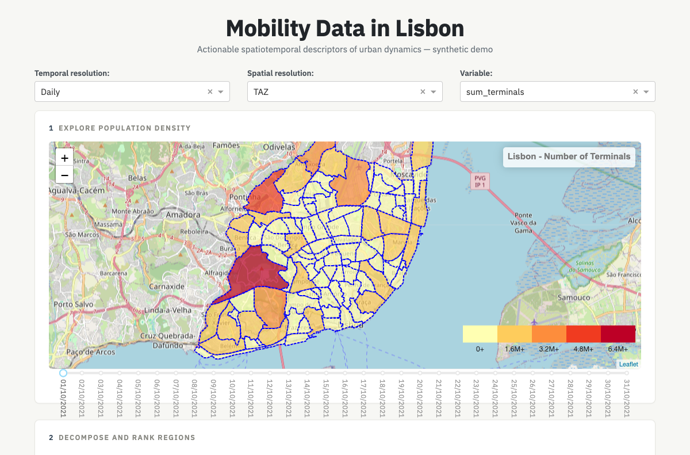
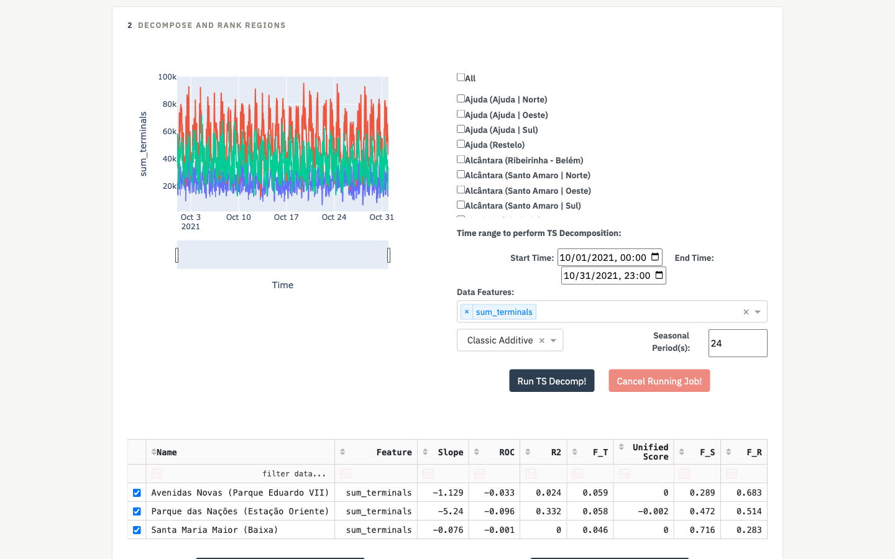
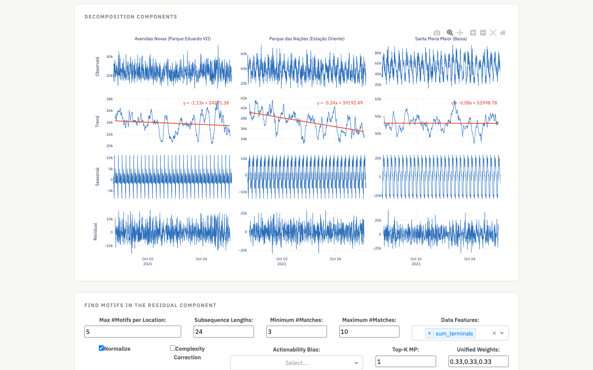
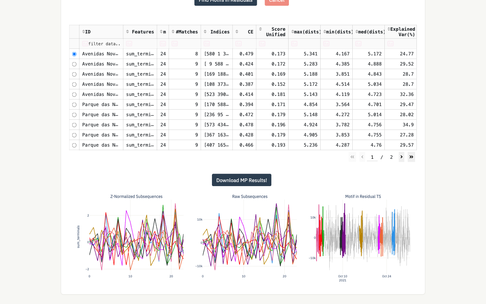

# cml_synthetic_demo

An interactive web application to discover **actionable spatiotemporal descriptors of urban dynamics** from mobile-phone network data, demonstrated on a synthetic dataset for Lisbon, Portugal.

This is the open-access tool accompanying the article:

> Silva, M. G., Madeira, S. C., and Henriques, R. (2024). **Actionable descriptors of spatiotemporal urban dynamics from large-scale mobile data: A case study in Lisbon city.** *Environment and Planning B: Urban Analytics and City Science*, 51(8):1725–1741. [doi:10.1177/23998083231219048](https://doi.org/10.1177/23998083231219048)

## What it does

- **Explore population density in space and time** — an interactive choropleth map of the number of mobile terminals over Lisbon, at a user-selected spatial resolution (grid cell, traffic-analysis zone, or township) and temporal resolution (hourly, daily, weekly, or monthly), with a time-range slider and per-region time-series plots.
- **Decompose the series and rank regions by actionable statistics** — classic additive, STL, or MSTL seasonal-trend decomposition per region, summarized in a sortable table of trend strength ($F_T$), seasonal strength ($F_S$), residual strength ($F_R$), rate of change, and a unified score, rendered back onto the map.
- **Find motifs in the residuals** — matrix-profile motif discovery ([stumpy](https://github.com/TDAmeritrade/stumpy)) over the decomposition residuals, univariate or multidimensional, with optional complexity correction and actionability bias (e.g., restrict to weekends or mornings), following the residual-motif analysis of the companion articles.

| Map exploration | Decomposition statistics |
| --- | --- |
|  |  |
| **Decomposition components** | **Motifs in residuals** |
|  |  |

## Quick start

Requires [Docker](https://docs.docker.com/get-docker/) (with Docker Compose, included in Docker Desktop).

```bash
git clone https://github.com/MiguelGarcaoSilva/cml_synthetic_demo.git
cd cml_synthetic_demo/webapp-docker
docker compose up --build
```

Then open <http://localhost:8050/home> in your browser.

On the first run, the stack builds the images, downloads the [synthetic dataset from Kaggle](https://www.kaggle.com/datasets/miguelgarcaosilva/synthetic-mp-data-in-lisbon) (~200 MB, no account needed), and populates the database — allow ~10 minutes in total. Subsequent runs are much faster. If the automatic download is not possible (e.g., no network access from containers), download the dataset manually from Kaggle and extract it so that the `SyntheticData` folder sits at `webapp-docker/devops/populate_db/SyntheticData/`.

To use a different port: `DASHBOARD_PORT=9000 docker compose up`.

### Suggested first analysis

1. On the home page, keep the defaults (Daily, TAZ, Terminals) and move the time slider to see density evolve over the map.
2. Tick a few regions in the checklist (or click regions on the map), then press **Run TS Decomp!** (seasonal period 7 = weekly seasonality on daily data) — the table ranks the selected regions by trend, seasonality, and residual strength, and the second map colors the selected rows by the chosen statistic.
3. For motif discovery, use a finer temporal resolution — the one-month daily series are too short for motifs. Switch the temporal resolution to **Hourly**, set the seasonal period to **24**, and re-run the decomposition. Then press **Check Decomposition Visualizations!**, select the data feature, set the subsequence length to **24**, and press **Find Motifs in Residuals** to search for recurring non-periodic daily-shaped patterns in the residual component. Selecting a row in the table plots that motif's occurrences.

## Architecture

Three Docker services, orchestrated by `webapp-docker/docker-compose.yml`:

| Service | Role |
| --- | --- |
| `db` | TimescaleDB (PostgreSQL 16 + PostGIS); schema created from `devops/db/schema_synthetic.sql` |
| `populate_db` | One-shot job that loads the synthetic dataset and creates the aggregation views (`devops/populate_db/`) |
| `dashboard` | The [Dash](https://dash.plotly.com/) application (`app/`), served by gunicorn and published on port 8050 |

## Troubleshooting

- **Nothing on localhost:8050** — the dashboard only starts after `populate_db` finishes (a few minutes on first run). Follow progress with `docker compose logs -f populate_db`.
- **`populate_db` exits immediately** — the dataset is missing; the log explains where to put it (step 2 above).
- **Slow or unresponsive at fine resolutions** — hourly data at cell level is the heaviest combination (3,743 series); prefer TAZ/township or daily aggregation on modest hardware, and give Docker at least 4 GB of memory.
- **Start over from a clean database** — `docker compose down -v`, then `docker compose up --build`.
- **Inspecting the database** — the DB port is not published to the host; use `docker exec -it db psql -U postgres`.

## License and citation

Code is released under the [MIT License](LICENSE). If you use this software in your research, please cite the article above (see [CITATION.cff](CITATION.cff)).

Contact: mmgsilva@fc.ul.pt
